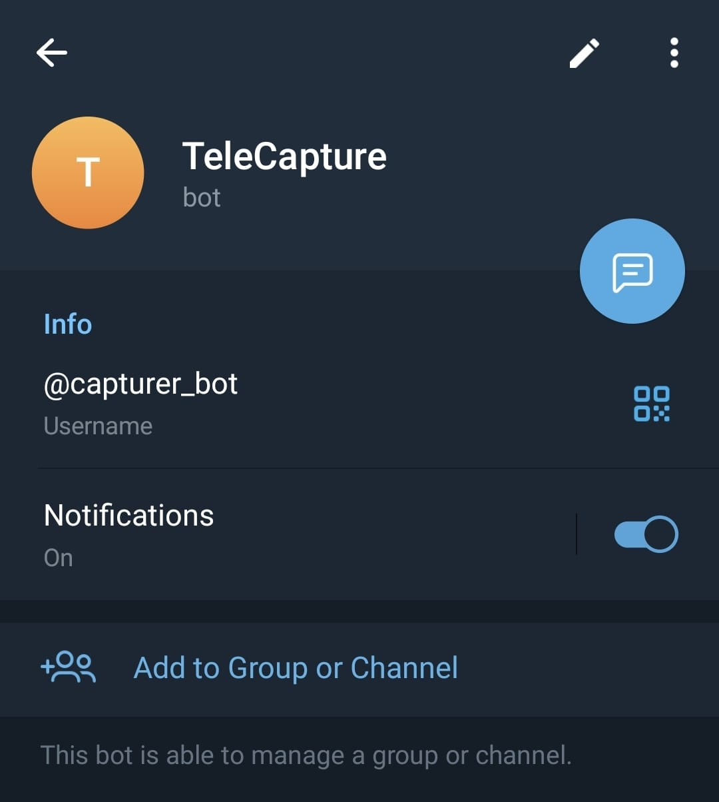

# TeleCapture

This is a system which receives feedback from Telegram (third party API) and sends it to all relevant users (collaboration) along with showing previous messages (database).
Stack Used: Node.js, Express.js, Typescript, MongoDB, Redis, Docker


## Prerequisites

Prerequisites to test the application are as follows:
- Create a .env file and ask the author to share the content. 
- Follow the steps given below to run the codebase locally with/without Docker.
- Send a message to this Bot on Telegram either in private chat or on a group. If testing out for group, ensure that the Bot has the admin rights in that particular group.

- The messages sent will be dynamically loaded on local host:8000.


## Steps to run the application locally (without Docker)

- Clone the project from Github repository to your local machine.
- Run the following commands on your terminal to initialize npm and install all the relevant packages.

```
npm init
```

```
npm install
```

- Ask the author to share .env file to be consumed in the application .
- Use the following command and server will be up and running on PORT 8000 of your machine.

```
npm start
```

- Install Redis on your machine by following the steps in the [documentation](https://redis.io/docs/install/install-redis/), and run the following command on your terminal.

```
redis-server
```

- You may use RedisInsights to visualize the data stored in Redis.


## Steps to run the application locally (using Docker)

- Ensure that you have [Docker Desktop](https://docs.docker.com/desktop/?_gl=1*hma6xv*_ga*MTM4MDU4NjgxMC4xNzA1Njc4MjM3*_ga_XJWPQMJYHQ*MTcwNTgyMDI5OC43LjEuMTcwNTgyMDMxNS40My4wLjA.) installed and docker engine is running in the background.
- Run the following the command on your terminal while building the image for the first time and whenever you make any changes in the codebase (rebuild would be required in that case).

```
docker compose up --build
```

- For all the subsequent running of servers, just remove `--build` tag from the previous command. Now, both the containers (one containing the redis-server and other one with url-shortening-service) start running and we can test the APIs locally.


## General Modular Structure

We are following a MVC (Model-View-Controller) architecture here. The modular structure of the repository is as follows:

- `config`: This module contains all the configuration files; which typically returns an object establishing connection with the client in most of the cases. Initial connections to the Database cluster (MongoDB), Telegram BOT API, Redis client (PORT 6379 in this case) along with WebSocket setup are happening here.
- `controller`: This module contains all the relevant business logic. In our case, we are primarily making queries to the DB/cache, processing the queried data and sending response accordingly.
- `middleware`: This module contains all the middleware (request/response interceptors) to be used in our API.
- `model`: This module contains all the model schemas directing the way data is stored in documents. 
- `public`: This module contains the Public HTML, CSS and JS files, which together constitute our frontend user facing client.


## Bot Setup

We are using [Local Telegram Bot API](https://core.telegram.org/bots/api#using-a-local-bot-api-server). Long-polling is being used to dynamically receive updates as and when the `message` event is triggered in the API. We receive the message details as an object.


## Caching

We have used Redis Open-source for this project.
Three types of data structures have been used given the operations possible on each data structure in our use-case.
- Set: To maintain a collection of unique message ids, from where we can validate existence of a message object with corresponding id in the cache.
- Queue: A queue of maximum allowed size 100 ensures implementation of LRU (Least Recently Used) cache so that only the most recent 100 messages sent are stored in the cache. This also allows us to fetch a message id given its index, and the message id is thereafter used to query the corresponding message object.
- Hash: Message objects are stored in cache in the form of hash. The message object is a field value for a given key of the format `messages:<message-id>`.
This is how we use Redis as a primary database in our application.


## Setting up Websocket

We are using socket.io to broadcast the messages on the client side by emitting the messages. Alongside, we are maintaining a counter of number of active clients and displaying it. To ensure that previous messages are not re-emitted to the currently active clients when a new client establishes a socket connection, a room named `already initialized` is used. This room maintains a registry of currently open sockets where messages are already loaded. This ensures that once a socket is opened and all the previosly sent messages are loaded, we only receive realtime updates thereafter.


## Troubleshooting

If you get this error in the console while establishing bot client, just try connecting to a different network. This should fix the issue in most cases.

```
error: [polling_error] {"code":"EFATAL","message":"EFATAL: Error: getaddrinfo ENOTFOUND api.telegram.org"}
```


## References

1. https://core.telegram.org/bots/api
2. https://www.youtube.com/watch?v=bFFMX1L8TKI
3. https://javascript.info/long-polling
4. https://stackoverflow.com/questions/24501756/sort-mongodb-documents-by-timestamp-in-desc-order
5. https://www.youtube.com/watch?v=RUL9yTzOTuU&list=PLdHg5T0SNpN09AlLBAYahKZUrAWsIL7No
6. https://socket.io/docs/v4/rooms/
7. https://redis.io/docs/data-types/
8. https://redis.com/redis-enterprise/technology/durable-redis/
